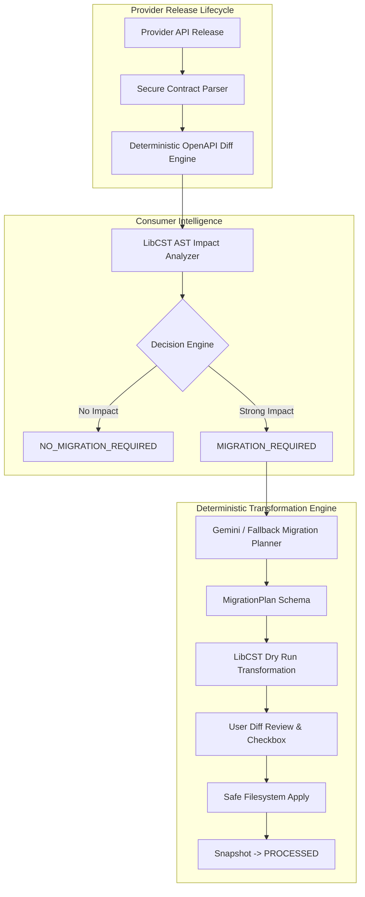

# API-Healer: LLM-Assisted CST Agent for Automated API Migrations

> **"Most tools tell you an API provider released a breaking change. API-Healer asks a more important question: Does your application actually use what changed?"**

API-Healer is an autonomous agent that monitors API provider releases, detects contract changes, analyzes consumer codebase impact at the AST level, generates structured migration plans, and applies safe, formatting-preserving source code transformations using LibCST.

---

## 🌟 Key Features

1. **Deterministic OpenAPI Diff Engine:** Compares OpenAPI v3 specifications to detect structural changes (property renames, endpoint removals, required field additions, type modifications).
2. **AST Consumer Impact Analyzer:** Uses LibCST to analyze your Python codebase for AST-level evidence of API usage. Unused breaking changes trigger **`NO_MIGRATION_REQUIRED`** instead of forcing unnecessary code updates.
3. **Structured Migration Planner:** Combines Gemini LLM reasoning with a robust **Deterministic Fallback Engine** to create structured, machine-executable migration steps.
4. **Safe CST Code Transformation:** Applies code edits deterministically with LibCST, preserving existing formatting, comments, and docstrings. Arbitrary LLM code rewriting is strictly prohibited.
5. **Snapshot Lifecycle Management:** Snapshot state (`INITIALIZED` → `CHANGE_DETECTED` → `MIGRATION_REQUIRED` → `PROCESSED`) transitions to `PROCESSED` **only** after code transformations are verified and successfully applied.
6. **Strict Security Controls:** Built-in SSRF protections, response size limits (10MB), and request timeouts.

---

## 🏗️ Architecture



---

## 🚀 Quick Start (Local Setup)

### Prerequisites
- Python 3.11+
- Node.js 18+

### 1. Install Backend & Frontend Dependencies
```bash
# Backend setup
cd backend
python -m venv .venv
# Activate venv: .venv\Scripts\activate (Windows) or source .venv/bin/activate (Linux/Mac)
pip install -r requirements.txt

# Frontend setup
cd ../frontend
npm install
```

---

## 🎬 3-Minute Live Hackathon Demo

API-Healer includes local mock fixtures and a local demo server so you can demonstrate the complete system deterministically without external internet dependencies.

### Step 1: Launch Demo Services
In terminal 1 (Demo Provider Mock Server):
```bash
python demo_server.py
```
In terminal 2 (Backend with Demo Mode Enabled):
```bash
cd backend
# Set Demo Mode environment variable to allow local mock provider URL:
set API_HEALER_DEMO_MODE=1    # Windows CMD
# or $env:API_HEALER_DEMO_MODE="1" # PowerShell
# or export API_HEALER_DEMO_MODE=1 # Linux/Mac

uvicorn app.main:app --port 8000
```
In terminal 3 (Frontend UI):
```bash
cd frontend
npm run dev
```
Open **`http://localhost:5173`** in your browser.

---

### Step 2: Scenario A — Affected Consumer (Migration Flow)

1. Click on the **Automated Monitoring** tab in the UI.
2. Click **"+ Quick Demo Preset"** to autofill the local demo provider details:
   - **Spec URL:** `http://localhost:8080/demo/v1.json`
   - **Repo Path:** `demo/consumer_app`
3. Click **Register Monitored Provider**. The status will show **`INITIALIZED (Baseline Set)`**.
4. Change the mock server spec to `v2_affected.json` (which renames parameter `user_id` → `account_id`):
   *(In `demo_server.py`, rename or copy `v2_affected.json` over `v1.json`, or update the provider spec URL to `http://localhost:8080/demo/v2_affected.json`)*.
5. Click **Check for Provider Release**.
6. **Observe Intelligence:** API-Healer detects the field rename, scans `demo/consumer_app/main.py`, identifies strong usage of `user_id`, and sets status to **`MIGRATION_REQUIRED`**.
7. Click **Generate & Apply Migration**. Review the LLM/fallback structured plan.
8. Click **Preview Changes / Dry Run** to see the LibCST unified diff preview.
9. Check the **User Acknowledgement** box and click **Apply Changes**.
10. **Verification:** `main.py` is safely updated, and the provider status transitions to **`PROCESSED`**.

---

### Step 3: Scenario B — Unused Breaking Change (No Migration Needed)

1. Register a new provider with URL `http://localhost:8080/demo/v1.json`.
2. Update the provider spec URL or mock payload to `http://localhost:8080/demo/v2_unused.json` (which removes the `/api/v1/analytics` endpoint).
3. Click **Check for Provider Release**.
4. **Observe Intelligence:** API-Healer detects the breaking endpoint removal, scans `main.py`, finds **NO usage** of `/api/v1/analytics`, and determines **`NO_MIGRATION_REQUIRED (No Consumer Impact)`**.
5. No code changes are forced on the developer!

---

## 🧪 Running Tests

```bash
cd backend
pytest tests/ -v
```
All **66+ tests** verify:
- Deterministic OpenAPI diffing
- Gemini fallback planner
- LibCST code transformation & safety
- Impact analysis (strong vs weak evidence)
- Provider snapshot lifecycle
- Strict SSRF allowlist protection

---

## 🛡️ Security & Safety Guarantees

- **No Arbitrary LLM Rewrites:** Code modifications are executed exclusively through LibCST AST transformers.
- **Mandatory Dry Run Gate:** Filesystem mutations require explicit user review and acknowledgement.
- **SSRF Protection:** Production mode blocks loopback/private IPs. Demo mode relies on strict URL prefix allowlists (`http://localhost:8080/demo/`).
